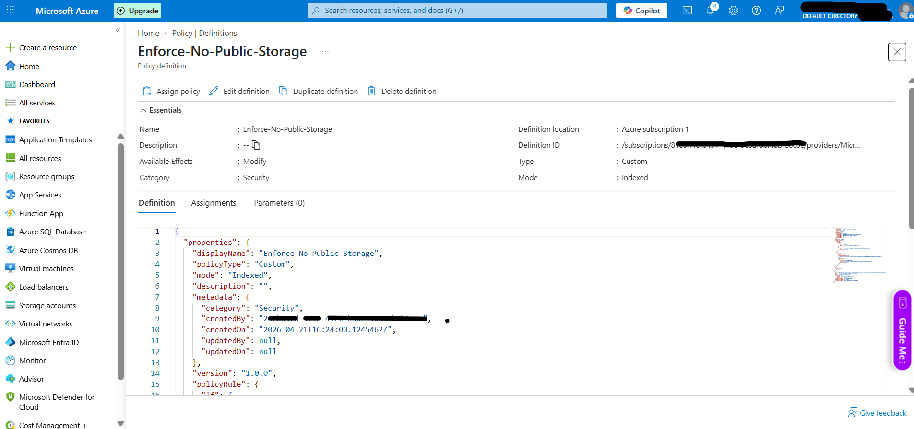
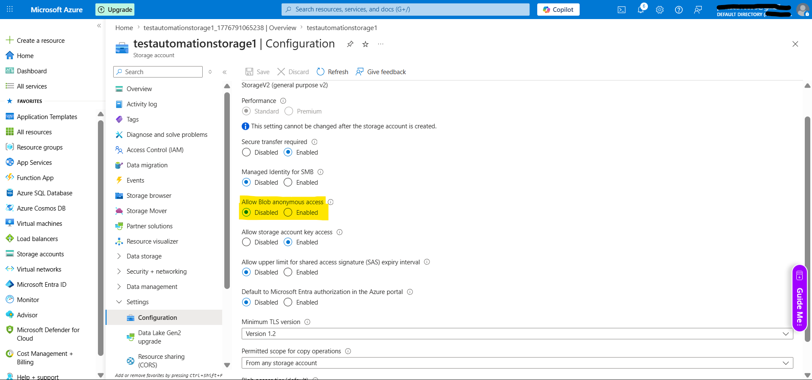

# Azure Automated Security Governance

## Project Overview
This project implements an **Automated Remediation** strategy using **Azure Policy** and **JSON**. It ensures that any Storage Account created within the Azure environment has "Public Blob Access" disabled automatically, preventing accidental data leaks.

## Problem Statement
Data breaches often occur due to "misconfiguration" (human error). By default, users might enable public access on storage containers. This project removes the human element by enforcing security via "Infrastructure as Code."

## Tech Stack
* **Platform:** Azure
* **Language:** JSON (Azure Policy Definition)
* **Service:** Azure Policy (Modify Effect)

## How it Works
The policy uses a `modify` effect. When a Storage Account is deployed:
1. It scans the `allowBlobPublicAccess` field.
2. If it is set to `true` or is missing, the policy intercepts the deployment.
3. It "patches" the configuration to `false` before the resource is even finished being built.

### Phase 1: Policy Definition
1. Navigate to **Azure Policy** > **Definitions** > **+ Policy Definition**.
2. Copy the contents of `public-access-policy.json` from this repo into the Policy Rule.
3. Save the definition as `Enforce-No-Public-Storage`.

### Phase 2: Assignment & Remediation
1. Assign the policy to your Subscription.
2. In the **Remediation** tab:
   - Check **Create a remediation task**.
   - Check **Create a Managed Identity** (This gives the policy permission to edit your storage settings).
3. Complete the assignment.

### Phase 3: Testing
1. Attempt to create a Storage Account with "Allow enabling anonymous access" **Checked**.
2. After deployment, navigate to the storage account's **Configuration** menu.
3. Observe that the setting has been automatically changed to **Disabled**.

## Future Improvements
* Add logic to send an email alert via **Azure Logic Apps** when a violation is caught.
* Expand the policy to cover **SQL Database** encryption settings.

## Evidence
### Policy Configuration

### Successful Auto-Remediation

